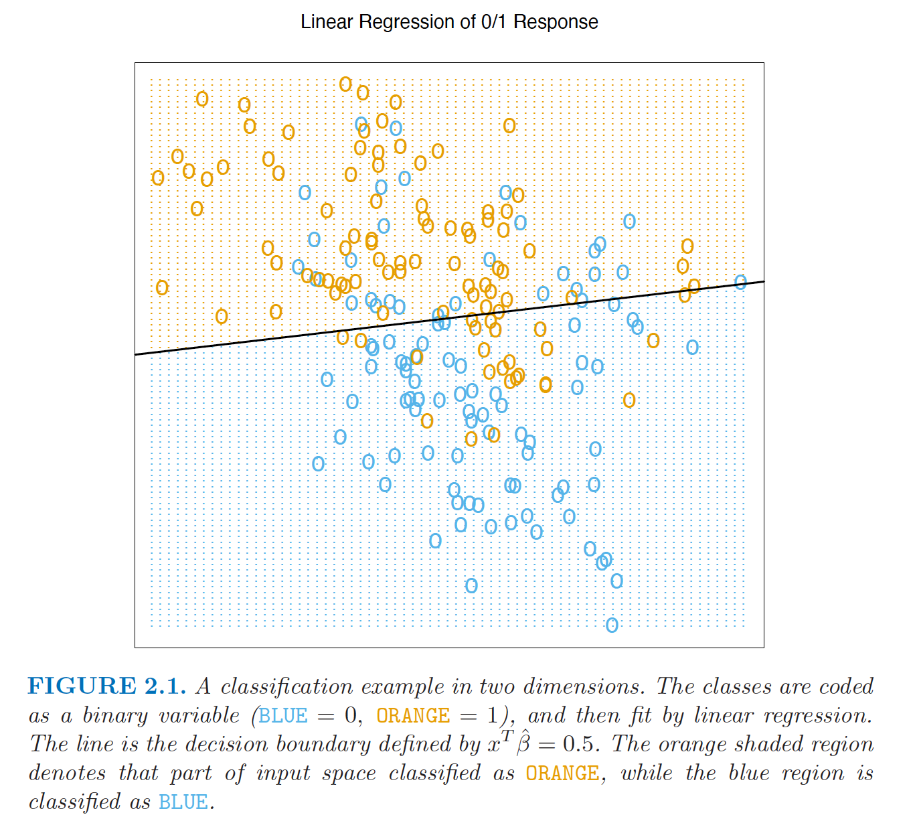

```{r include=FALSE}
knitr::opts_chunk$set(echo = TRUE, fig.align="center")
```
## Introduction 


This book was recommended by my professors to students who is intereseted in learnning more about machine learning methods, and I want to study this book also for the purpose of reviewing my statistics-related knowledge. I have finishd some of the exercises in this book on Chpater 2(Regression). My implementation of the R codes can be found [here]().

Due to my limited statistical knowledge, there may be some mistakes occured. Please feel free to point out any typos and mathematical analysis errors.

***

## Exercise 2.1

**Question:**

Suppose that each of K classes has an associated target $t_k$, which is a vector of all zeroes, except a one in the k-th position. Show that classifying the largest element of ŷ amounts to choosing the closest target$min_k‖t_{k}−ŷ ‖.$$if the elements of ŷ sum to one.

Also I found the third chapter related much to my regression course that have been taken, so I figured it might be a good practice to study it as a review of my course.

**Solution:**

If $\hat{y}$ sums to one and assume we are using Euclidean Distance:


\being{equation}
$argmin_k\left\|t_k-\hat{y}\right\| = argmin_k\left\|t_k-\hat{y}\right\|^2$
\end{equation}

\begin{equation} 
\begin{split}
\left\|t_k-\hat{y}\right\|^2
& = (t_k-\hat{y})^T(t_k-\hat{y}) \\
& = t_k^Tt_k-2t_k^T\hat{y}+\hat{y}^T\hat{y} \\
& = 1+\hat{y}^T\hat{y}-2\hat{y}_k 
\end{split}
\end{equation}

Since 1 +$\hat{y}^T\hat{y}$ is constant:

<center>
$argmin_k\left\|t_k-\hat{y}\right\|$ = $argmin_k (-2\hat{y}_k)$= $argmax_k( \hat{y}_k )$
</center>

Proved.

***

## Exercise 2.2

**Question:**

Show how to compute the Bayes decision boundary for the simulation
example in Figure 2.5.




Hastie, Tibshirani and Friedman.*The Elements of Statistical Learning (2nd edition)*. Page 13.

**Solution:**

Review of method that generates the BLUE class and ORANGE class points:

Generate 10 means $m_k$ from bivariate Gaussian distribution: N($(1,0)^T$,**I**), they are labeled as BlUE class. Then generate 100 observations of N($m_k$,**I**/5) with  each mean $m_k$ having probability 1/10.

Similarly, we generate 10 means $m_k'$  from bivariate Gaussian distribution: N($(0,1)^T$,**I**) and label them as ORANGE class. Then generate 100 observations of N($m_k'$,**I/5**) with  each mean $m_k'$ having probability 1/10. 

Priors:

<center>
P($\mathcal G_{BLUE}$) = 1/2

P($\mathcal G_{ORANGE}$) = 1/2
</center>


Likelihood:

\begin{equation} 
\begin{split}
P(\mathrm X = x |\mathcal G_{BLUE}) 

& = \sum_{k=1}^{10}  P(\mathrm X = x |m = m_k,\mathcal G_{BLUE})P(m = m_k | \mathcal G_{BLUE}) \\

& = \sum_{k=1}^{10} (2\pi)^{-1} (\frac{I}{5})^{-1/2} e^{-\frac{1}{2}(x-m_k)^T(\frac{I}{5})^{-1}(x - m_k)} \frac{1}{10}  \\

& = \sum_{k=1}^{10} (2\pi)^{-1} (\frac{I}{5})^{-1/2} e^{-\frac{5}{2}\left\|x-m_k\right\|^2} \frac{1}{10}
\end{split}
\end{equation} 


Similarly for ORANGE class:

<center>
P($\mathrm X = x |\mathcal G_{ORANGE}$) 

= $\sum_{k=1}^{10} (2\pi)^{-1} (\frac{I}{5})^(-1/2) e^{-\frac{5}{2}\left\|x-m_k'\right\|^2} \frac{1}{10}$
</center>

Now we can calculate the posterior probability:

<center>
P($\mathcal G_{BLUE}|\mathrm X = x$) = $\frac  {P(\mathrm X = x | \mathcal G_{BLUE}) P(G_{BLUE})}{P{(\mathrm X = x)}}$) 

P($\mathcal G_{ORANGE}|\mathrm X = x$) = $\frac  {P(\mathrm X = x | \mathcal G_{ORANGE})P(\mathcal G_{ORANGE})}{P{(\mathrm X = x)}}$
</center>

Let the two posterior probability equal and we get:

<center>
$\sum_{k=1}^{10} exp(-\frac{5}{2}\left\|x-m_k\right\|^2)$ = $\sum_{k=1}^{10} exp(-\frac{5}{2}\left\|x-m_k'\right\|^2$
</center>

Note: 
For multivariate Gaussian distribution N $(\mu$, $\Sigma$)

where $\mu$ $\in$ $\mathrm R ^k$ and  $\Sigma$ $\in$ $\mathrm R^{k\times k}$

PDF = $(2\pi)^{-k/2}$$det(\Sigma)^{-1/2}$$e^{-(1/2) (x-\mu )^T(\Sigma )^{-1}(x -\mu )}$; [See:Wikipedia](https://en.wikipedia.org/wiki/Multivariate_normal_distribution)

     
    
Hence **decision boundary**:  

<center>
{x: $\sum_{k=1}^{10} exp(-\frac{5}{2}\left\|x-m_k\right\|^2) - \sum_{k=1}^{10} exp(-\frac{5}{2}\left\|x-m_k'\right\|^2 = 0$}
</center>

Or:

BLUE: if the result > 0

ORANGE: if the result < 0

***

## Exercise 2.3

**Question:**

Derive equation 2.24:  
d(p,N) = $(1 -{\frac{1}{2}^{\frac{1}{N}}})^\frac{1}{P}$  
See *The Elements of Statistical Learning (2nd edition)*, page 23.  


**Solution:**

The equation is talking about the median distance from the origin to the cloest data point. 

Since that the N data points are uniformly distributed in a p-dimensional unit ball centered at the origin. Suppose $d_i$ is the distance between the ith point and the origin. The distrubition of $d_i$ :

<center>
$P(d_i\le d ) = \frac{d^p}{1^p} = d^p$
</center>

Suppose the cloest distance have a distance of D, then the cumulative distribution function of D can be written as:  

<center>
P($D\le d$)  = 1 -  $\prod^{n=N}_{i=1}P(d_i > d)$ = 1 - $(1-d^p)^N$  
</center>


Now to find the median shortest distance, we simply plug 1/2 into the cumulative distribution function of D: 

<center>
P($D\le d$) = $\frac{1}{2}$ 
</center>

Solve the equation we get:  

<center>
d = $(1 -{\frac{1}{2}^{\frac{1}{N}}})^\frac{1}{P}$  
</center>
***

## Exercise 2.4:

**Question:**

The edge effect problem discussed on page 23 is not peculiar to uniform sampling from bounded domains. Consider inputs drawn from a spherical multinormal distribution X ∼ N(0, Ip). The squared distance from any sample point to the origin has a $χ^2$
p distribution with mean p. Consider a prediction point x0 drawn from this distribution, and let a =
$x_0/\left\|x_0\right\|$ be an associated unit vector. Let $z_i$ = $a^Tx_i$ be the projection of
each of the training points on this direction.   
  Show that the zi are distributed N(0, 1) with expected squared distance from the origin 1, while the target point has expected squared distance p
from the origin.  
  Hence for p = 10, a randomly drawn test point is about 3.1 standard deviations from the origin, while all the training points are on average one standard deviation along direction a. So most prediction see
themselves as lying on the edge of the training set.
  
**Solution:**

First it should be clear that if $X$ is said to multinormal distributed then its linear combination of its components has a univariate normal distribution.

1.  
Hence the projections $z_i$ are normally distributed. Furthermore,

  Expectation: E($z_i$) = E($a^Tx_i$) = $a^T$E($x_i$) = 0 (by definition of the distribution of $x_i$)

  Variance:  Var($z_i$) =  $a^T$Var($z_i$)$a$ =  $a^T$$I_p$$a$
(because Var(AX) = AVar(X)$A^T$)  

2.  
Since $z_i$ ~ N(0,1), $z_i^2$ ~ $\chi^2$ with degrees of freedom 1(by the definition of $\chi^2$ distribution). Hence the mean is 1.

3.  
Our prediction point(target point)'s expected squared distance is:

\begin{equation} 
\begin{split}
E({\left\|x_0 \right\|}^2) 
&= \sum^p_i E(x_{0i}^2) \\
&=\sum^p_i (Var(x_{0i}^2) + E(x_{0i})^2) \\
&= \sum^p_i Var(x_{0i}^2) = \sum^p_i 1 = p
\end{split}
\end{equation}

(The covariance maxtrix is $I_p$)


Therefore, the distance between our prediction points $X_0$ to the origin is about $\sqrt p$ = $\sqrt 10$ standard deviations, but training points ($z_i$) have only one standard deviation. 
Hence the postion $x_0$ is likely to be  on the edge of trainning points.

***

## Exercise 2.5

**Question:**

(a) Derive equation (2.27). The last line makes use of (3.8) through a conditioning argument.

(b) Derive equation (2.28), making use of the cyclic property of the trace operator [trace(AB) = trace(BA)], and its linearity (which allows us
to interchange the order of trace and expectation).

**Solution:**

Part (a): 

**Model**:

y = $X\beta +\epsilon$, where $\epsilon$ is uncorrelated and normally distributed with mean 0 and variance $\sigma^2$. 

Also, X is a $N\times\beta$ vector, Y is a $N\times1$ vector and $\beta$ is $p\times1$.

Given $x_0$, the expected values of $x_0$ is fixed:
<center>
$E(y_0|x_0) = x_0^T\beta$
</center>

Our least-square estimator derived from normal equations: 

<center>  $\hat{\beta} = (X^TX)^{-1}X^Ty$ </center>

Under our model, 

\begin{gather*}

E(\hat{\beta}) 
=  E[\beta + (X^TX)^{-1}X^T\epsilon] = \beta \\

Var(\hat{\beta}) =  Var[(X^TX)^{-1}X^Ty] =  (X^TX)^{-1}X^T(\sigma^2)X(X^TX)^{-1}  = (X^TX)^{-1}(\sigma^2)

\end{gather*}

Hence,


$Var(\hat{y_0})$ = $Var(x_0^T\hat{\beta})$ = $x_0^T(X^TX)^{-1}x_0\sigma^2$ (2.5.1)


If our estimated $\hat{y_0}$ = $x_0^T\hat{\beta}$, then:

<center>$E_{\tau}(\hat{y_0})$ = E($x_0^T\hat{\beta}$) = $x_0^T\beta$</center> 

and has no relationship with $y_0$.

Decompose the inner square:

<center>
$E_{y_0|x_0}[E_{\tau}(y_0-\hat{y_0})^2]$ = $E_{y_0|x_0}[E_{\tau}[(y_0-E_{\tau}\hat{y_0})+(E_{\tau}\hat{y_0}-\hat{y_0})]^2]$
</center>

First look at the inner expectation term: 

\begin{equation}
\begin{split}
E_{\tau}[(y_0-E_{\tau}\hat{y_0})+(E_{\tau}\hat{y_0}-\hat{y_0})]^2

& = E_{\tau}((y_0-E_{\tau}\hat{y_0})^2) + E_{\tau}(E_{\tau}\hat{y_0}-\hat{y_0})^2 +2E_{\tau}[y_0-E_{\tau}\hat{y_0}][E_{\tau}\hat{y_0}-\hat{y_0}]\\

& = (y_0-E_{\tau}\hat{y_0})^2 + E_{\tau}(E_{\tau}\hat{y_0}-\hat{y_0})^2 +2[y_0-E_{\tau}\hat{y_0}][E_{\tau}\hat{y_0}-E_{\tau}\hat{y_0}] \\

& = (y_0-E_{\tau}\hat{y_0})^2 + E_{\tau}(E_{\tau}\hat{y_0}-\hat{y_0})^2$ (2.5.2)
\end{split}
\end{equation}


Then decompose $y_0-E_{\tau}\hat{y_0}$ into $y_0-E(y_0|x_0)+E(y_0|x_0)-E_{\tau}\hat{y_0}$, then 2.5.2 becomes:

\begin{equation}
(y_0-E(y_0|x_0))^2 + 2(y_0-E(y_0|x_0))(E(y_0|x_0)-E_{\tau}\hat{y_0}) + (E(y_0|x_0)-E_{\tau}\hat{y_0})^2
\end{equation}


Hence the inner expectation $E_{\tau}[(y_0-E_{\tau}\hat{y_0})+(E_{\tau}\hat{y_0}-\hat{y_0})]^2$ is:

\begin{equation}
(y_0-E(y_0|x_0))^2 + 2(y_0-E(y_0|x_0))(E(y_0|x_0)-E_{\tau}\hat{y_0}) + (E(y_0|x_0)-E_{\tau}\hat{y_0})^2 + E_{\tau}(E_{\tau}\hat{y_0}-\hat{y_0})^2
\end{equation}


Therefore:

\begin{multline*}
E_{y_0|x_0}[E_{\tau}(y_0-\hat{y_0})^2]

= E_{y_0|x_0}[(y_0-E(y_0|x_0))^2 + 2(y_0-E(y_0|x_0))(E(y_0|x_0)-E_{\tau}\hat{y_0}) \\ + (E(y_0|x_0)-E_{\tau}\hat{y_0})^2 + E_{\tau}(E_{\tau}\hat{y_0}-\hat{y_0})^2
\end{multline*}


Note:
\begin{align*} 
(1)&.E_{y_0|x_0}[(y_0-E(y_0|x_0))^2 = Var(y_0|x_0) \\

(2)&.2 E_{y_0|x_0}[(y_0-E(y_0|x_0))(E(y_0|x_0)-E_{\tau}\hat{y_0})] = 2 E_{y_0|x_0}(y_0-E(y_0|x_0))(E(y_0|x_0)-E_{\tau}\hat{y_0}) = 0 \\

(3)&.(E(y_0|x_0)-E_{\tau}\hat{y_0})^2= Bias(\hat{y_0})^2 \\

(4)&.E_{y_0|x_0}[E_{\tau}(E_{\tau}\hat{y_0}-\hat{y_0})^2] = E_{\tau}E_{\tau}\hat{y_0}-\hat{y_0})^2 = Var_{\tau}(\hat{y_0}))
\end{align*}

So we have:

<center>
$E_{y_0|x_0}[E_{\tau}(y_0-\hat{y_0})^2]$ = $Var(y_0|x_0) + Bias(\hat{y_0})^2 +Var_{\tau}(\hat{y_0})$
</center>


*The conditional variance* 
\begin{equation} 
Var(y_0|x_0) = Var(x_o^T\beta + \epsilon|x_0) = Var(\epsilon) = \sigma^2
\end{equation} 

*and*
\begin{equation}
$E_{\tau}\hat{y_0} = E(y_0|x_0) = x_0^T\beta$,
\end{equation} 

so $Bias(\hat{y_0})^2 = 0$

*From 2.5.1, $Var_{\tau}(\hat{y_0})$ = $E_{\tau}x_0^T(X^TX)^{-1}x_0\sigma^2$, since we are averaging over traing set *$\tau$:

<center>
$Var_{\tau}(\hat{y_0})$ = $E_{\tau}x_0^T(X^TX)^{-1}x_0\sigma^2$
</center>

We have:
<center>
$E_{y_0|x_0}[E_{\tau}(y_0-\hat{y_0})^2]$ = $\sigma^2 + E_{\tau}x_0^T(X^TX)^{-1}x_0\sigma^2$
</center>

Here the prediction error include $\sigma^2$ since the target is not deterministic

Proved.

Part(b):

Background:

We know that if N is large and E(X) = 0, then:
<center> $(X^TX) -> NCov(X)$ </center>

Hence:

<center>
$(X^TX)^{-1} = Cov^{-1}(X)/N$
</center>

And:
<center>
$E_{x_0}[EPE(X_0)]$ = $E_{x_0}[x_0^TCov^{-1}(X)x_0\sigma^2/N] +\sigma^2$
</center>

Note that $x_0^TCov^{-1}(X)x_0$ is 1 by 1 matrix

The above could be expressed by:

\begin{equation} 
\begin{split}
trace(E_{x_0}[x_0x_0^T\times Cov^{-1}(X)]\sigma^2/N ) +\sigma^2 

& = trace[E_{x_0}[x_0x_0^T]\times Cov^{-1}(X)]\sigma^2/N + \sigma^2
\end{split}
\end{equation}

\begin{equation} 
\begin{split}
Since E_{x_0}(x_0^Tx_0) 
& = E_{x_0}(\sum{(X_{0i})^2}) \\
& = E_{x_0}(\sum{(X_{0i}-0)^2}) \\
& = E_{x_0}(\sum{(X_{0i}-E(X_0))^2}) \\
& = Cov(X)
\end{split}
\end{equation}

The above is equal to:
\begin{equation}
trace[Cov(X)\times Cov^{-1}(X)]\sigma^2/N + \sigma^2 = trace(I_p)\sigma^2/N + \sigma^2
\end{equation}

***

## Exercise 2.6

**Question:**

Consider a regression problem with inputs $x_i$ and outputs $y_i$, and a
parameterized model $f_θ(x) $to be fit by least squares. Show that if there are observations with tied or identical values of x, then the fit can be obtained from a reduced weighted least squares problem.

**Solutions: **

Suppose  there are $m_i$ observations at $x_i$ = 1,...,m
N = $\sum_{i=1}^{m} {m_i}$
and $\hat y_i$ = $f_{\theta}(x_i)$

Decompose $y_{ij} - \hat y_i$ into $(y_{ij} - \bar y_{i.})$ + $(\bar y_{i.} - \hat y_i)$ where $bar y_{i.}$ is the mean of $i_th$ group


\begin{equation}
\begin{split}
RSS(\theta) 
& = \sum_{i=1}^{n=N} (y_i - \hat y_i)^2 \\

& = \sum_{i=1}^m \sum_{j=1}^{m_i} [(y_{ij} - \bar y_{i.})^2 + 2(y_{ij} - \bar y_{i.})(y_{i.} - \hat y_i) + (y_{i.} - \hat y_i)^2]
\end{split}
\end{equation}

First consider the second 
\begin{equation} 
\begin{split}
\sum_{i=1}^m \sum_{j=1}^{m_i}2(y_{ij} - \bar y_{i.})(y_{i.} - \hat y_i)

& = 2\sum_{i=1}^m(y_{i.} - \hat y_i)\sum_{j=1}^{m_i}(y_{ij} - \bar y_{i.}) \\

& =  0
\end{split}
\end{equation}

The third term
\begin{equation}
\begin{split}
\sum_{i=1}^m \sum_{j=1}^{m_i} (y_{i.} - \hat y_i)^2

& =  \sum_{i=1}^m m_i(y_{i.} - \hat y_i)^2
\end{split}
\end{equation}

If we only need mimize the RSS with respect to $\theta$, the second term could be ognored.

Hence our RSS($\theta$) = $\sum_{i=1}^m m_i(y_{i.} - \hat y_i)^2$.
Here our our residual squares is weighted by $m_i$, which is how many identical values of x on each level.

***
## Exercise 2.7:

*Question:*

Suppose we have a sample of N pairs xi, yi drawn i.i.d. from the
distribution characterized as follows:
<center>
$x_i$ ~ $h(x)$, the design density

$y_i = f(x_i) + \epsilon$, f is the regression function

$\epsilon ∼ (0, \sigma^2)$ (mean zero, variance $\sigma^2$)

</center>

We construct an estimator for f linear in the $y_i$,

<center>
$\hat{f(x_0)} =\sum_{i=1}^N \ell (x_0;\mathcal X)y_i$
</center>


where the weights $\ell(x_0;\mathcal X)$ do not depend on the yi, but do depend on the entire training sequence of xi, denoted here by $\mathcal X$.

(a)Show that linear regression and k-nearest-neighbor regression are members of this class of estimators. Describe explicitly the weights $\ell (x_0;\mathcal X)$ in each of these cases.

(b)Decompose the conditional mean-squared error
<center>
$E_{\mathcal Y|\mathcal X} (f(x_0) − f(\hat{x_0}))^2$
</center>
into a conditional squared bias and a conditional variance component.
Like $\mathcal X$, $\mathcal Y$ represents the entire training sequence of $y_i$.

(c)Decompose the (unconditional) mean-squared error
<center>
$E_{\mathcal Y,\mathcal X}{(f(x_0) − f(\hat {x_0}))^2}$
</center>
into a squared bias and a variance component.

(d)Establish a relationship between the squared biases and variances in the above two cases.

**Solution: **

Part(a):

Recall in linear regression, $\beta$ is just a linear combination of the obsercations and it follows with mean $\beta$ and covariance matrix $\sigma^2(X^TX)^{-1}$:

\begin{equation} 
\hat y_0 = \hat f(x_0) = {x_0}^T\hat{\beta} = x_0^T(X^TX)^{-1}X^TY
\end{equation} 

\begin{equation} 
\hat{f(x_0)} =\sum_{i=1}^N \ell(x_0;\mathcal X)sy_i
\end{equation} 
where $\ell(x_0;\mathcal X)$ = $x_0^T(X^TX)^{-1}X^T$

Y is N x 1, $(X^TX)^{-1}X^T$ is p$\times$N, $and x_0^T$ is 1$\times$p.

$\hat f(x_0) =  Ave(y_i|x_i \in N_k(x))$ where $N_k(x)$ is the neighbourhood containing x 

We can use an indicator to specify whether the condition: 

<center>
$I(\left\|x_i-x_0\right\| \le \left\|x_{(k)}-x_0\right\|)$
</center>


where $x_{(k)}$ is the training observation ranked kth in distance from $x_0$ 
and $x_i \in N_k(x)$ 

\begin{equation} 
\begin{split}
\hat f(x_0) 
& =  Ave(y_i|x_i \in N_k(x)) \\
& = \sum_{i=1}^k \frac{1}{k}I(\left\|x_i-x_0\right\| \le \left\|x_{(k)}-x_0\right\|)
\end{split}
\end{equation} 

Hence 
\begin{equation} 
\begin{split}
\ell(x_0;\mathcal X)  
& = I(\left\|x_i-x_0\right\| \le \left\|x_{(k)}-x_0\right\|) 
\end{split}
\end{equation} 

Part(b):

\begin{equation} 
\begin{split}
E_{\mathcal Y|\mathcal X} (f(x_0) − \hat f{(x_0)} )^2

& = E_{\mathcal Y|\mathcal X} (f(x_0) − E_{\mathcal Y|\mathcal X}{\hat f(x_0)} + E_{\mathcal Y|\mathcal X}{\hat f(x_0)} - \hat f{(x_0)})^2 \\

& = E_{\mathcal Y|\mathcal X}(f(x_0) − E_{\mathcal Y|\mathcal X}{\hat f(x_0)})^2 
+ E_{\mathcal Y|\mathcal X}(E_{\mathcal Y|\mathcal X}{\hat  f(x_0)} - \hat f{(x_0)})^2
+ 2E_{\mathcal Y|\mathcal X}(E_{\mathcal Y|\mathcal X}{\hat f(x_0)} - \hat f{(x_0)})(f(x_0) − E_{\mathcal Y|{\mathcal X}}{\hat f(x_0)}) 

\end{split}
\end{equation}

The third term is 
\begin{equation}
2E_{\mathcal Y|{\mathcal X}}(E_{\mathcal Y|\mathcal X}{\hat f(x_0)} - \hat f{(x_0)})E_{\mathcal Y|\mathcal X}(f(x_0) − E_{\mathcal Y|\mathcal X}{\hat f(x_0)}) = 0
\end{equation}


Hence
<center>
$E_{\mathcal Y|\mathcal X} (f(x_0) − \hat f{(x_0)} )^2$ = $Var(\hat f(x_0)|\mathcal X)$ + $Bias(\hat f{(x_0)}|\mathcal X)^2$ 
</center>


Part(c):

Similarl to part(b):

\begin{equation}
\begin{split}
E_{\mathcal Y,\mathcal X} (f(x_0) − \hat f{(x_0)} )^2


& =  E_{\mathcal Y,\mathcal X}(f(x_0) − E_{\mathcal Y,\mathcal X}{\hat f(x_0)})^2 
+ E_{\mathcal Y,\mathcal X}(E_{\mathcal Y,\mathcal X}{\hat f(x_0)} - \hat f{(x_0)})^2
+ 2E_{\mathcal Y,\mathcal X}(E_{\mathcal Y,\mathcal X}{\hat f(x_0)} - \hat f{(x_0)})(f(x_0) − E_{\mathcal Y,\mathcal X}{\hat f(x_0)}) \\


& =  Var(\hat f(x_0)) + Bias(\hat f{(x_0)})^2 
\end{split}
\end{equation}


part(d):

We can factor the joint density into the 
f(X,Y) = f(Y|X)Pr(X) = f(Y|X)h($\mathcal X$)

\begin{equation} 
\begin{split}
E_{\mathcal Y,\mathcal X} (f(x_0) − \hat f{(x_0)} )^2
& = \int  (f(x_0) − \hat f{(x_0)} )^2f(Y|X)

E_{\mathcal Y|\mathcal X} (f(x_0) − \hat f{(x_0)} )^2 \\

& =\int \int (f(x_0) − \hat f{(x_0)} )^2f(X,Y) \\

& =\int \int (f(x_0) − \hat f{(x_0)} )^2f(Y|X)h(\mathcal X)
\end{split}
\end{equation}

Hence
\begin{equation}
E_{\mathcal Y,\mathcal X} (f(x_0) − \hat f{(x_0)} )^2 = 
E_{\mathcal X}[E_{\mathcal Y|\mathcal X} (f(x_0) − \hat f{(x_0)} )^2]
\end{equation}

The relationship between the decompositions is 

\begin{equation}
Var(\hat f(x_0)) + Bias(\hat f{(x_0)})^2 = \int [Var(\hat f(x_0)|\mathcal X) + Bias(\hat f{(x_0)}|\mathcal X)^2] h(\mathcal X)
\end{equation}

***

